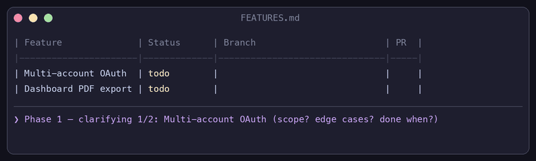

# feature-status-tracker

🇬🇧 English (below) · 🇫🇷 [Français](#-français)

A Claude Code skill that turns a simple Markdown feature table into an autonomous development pipeline: Claude clarifies each feature with you, then develops on its own — one Git branch per feature — until the whole table is done.

Designed to build on [Superpowers](https://github.com/obra/superpowers) (git worktrees, TDD, code review, branch close-out) — with a manual fallback if Superpowers is not installed.



**Before** — you write this:

```markdown
| Feature              | Status |
|----------------------|--------|
| Multi-account OAuth  | todo   |
| Dashboard PDF export | todo   |
```

**After** — Claude clarified with you, then developed alone, and left this:

```markdown
| Feature              | Status | Clarifications                        | Branch                       | PR  |
|----------------------|--------|---------------------------------------|------------------------------|-----|
| Multi-account OAuth  | done   | TikTok+IG only for v1, auto refresh…  | feature/multi-account-oauth  | #42 |
| Dashboard PDF export | done   | A4 portrait, last 30 days of data…    | feature/dashboard-pdf-export | #43 |
```

Two open PRs waiting for your review. Nothing merged without you.

---

## What does it do?

You give Claude a Markdown file like:

```markdown
| Feature | Description | Status |
|---|---|---|
| Multi-account OAuth | Connect several social accounts per workspace | todo |
| Dashboard PDF export | Export the KPI dashboard as PDF | todo |
```

**No table yet? A raw list works too.** Paste a plain bullet list of features (or point to a notes file) and the skill builds the `FEATURES.md` table for you — splitting items that bundle several deliverables, merging duplicates — shows you the result for approval, then continues with the normal pipeline.

The skill then runs through 4 phases, in this strict order:

1. **Clarification** — Claude walks through every `todo` row and asks you targeted questions (scope, edge cases, dependencies, definition of "done"). Answers are written directly into the file, in a `Clarifications` column. **No code is written during this phase.**
2. **Confirmation gate** — once the whole table is clarified, Claude gives you a summary and waits for your explicit green light before writing any code.
3. **Autonomous development** — for each feature, in table order: create a `feature/<slug>` branch, develop (TDD if Superpowers is there), self-review, commit, push, **local Pull Request against your main branch (never an automatic merge)**, then update the status to `done` in the table. Claude moves on to the next feature by itself, without coming back to you.
4. **Final report** — summary of the branches/PRs created, plus the list of blocked features (if any) with the reason, so you can decide.

If a feature gets stuck along the way (missing dependency, technical ambiguity discovered too late...), it is marked `blocked` with the reason, and Claude continues with the next one instead of stopping the whole run.

Tables in **English or French** both work (`Status`/`Statut`, `todo`/`à faire`, `blocked`/`bloquée`...) — the skill detects the language of your table and sticks to it.

### What this skill does NOT do

- It never automatically merges a branch into the main branch — always an open PR, awaiting your review.
- It never codes before the clarification of **every** feature in the table is complete.
- It never invents acceptance criteria: if an answer is missing to develop correctly, it asks you rather than guessing.

---

## Installation

### Option A — Plugin install (recommended, 2 commands)

Inside Claude Code:

```
/plugin marketplace add barryaliou980/feature-status-tracker
/plugin install feature-status-tracker@aliou-skills
```

That's it. Updates are picked up with `/plugin marketplace update aliou-skills`.

### Option B — Manual copy (no plugin system)

The skill itself is a plain folder with a `SKILL.md` — no dependencies. Copy `skills/feature-status-tracker/` from this repo into your skills directory:

```bash
git clone https://github.com/barryaliou980/feature-status-tracker.git /tmp/feature-status-tracker
# personal skill, available in all your projects:
cp -r /tmp/feature-status-tracker/skills/feature-status-tracker ~/.claude/skills/
# OR scoped to a single project:
cp -r /tmp/feature-status-tracker/skills/feature-status-tracker /path/to/your-project/.claude/skills/
```

The `SKILL.md` must sit **directly** inside the copied folder (`~/.claude/skills/feature-status-tracker/SKILL.md`), not deeper.

### After installation

- If you add the skill during an already-open Claude Code session, it is picked up immediately (no restart needed), unless you just created the `skills/` folder itself for the first time — in that case, restart the session.
- Recommended but optional: also install [Superpowers](https://github.com/obra/superpowers) (`/plugin marketplace add obra/superpowers-marketplace` then `/plugin install superpowers@superpowers-marketplace`). The skill works without it, but with Superpowers it automatically delegates worktree management, TDD, code review and branch close-out to specialized, battle-tested skills.

---

## Usage

### 1. Prepare your table — or just a list

Create a Markdown file (e.g. `FEATURES.md`) at the root of your project with at least the columns `Feature`, `Description`, `Status`. The skill enriches the file itself with the `Clarifications`, `Branch`, `PR` columns if they don't exist yet.

No table? Paste a raw bullet list of features in the chat (or point to a notes file) — the skill converts it into `FEATURES.md`, shows you the proposed table for approval, then moves on.

### 2. Start the clarification

In Claude Code, open a session in your project and simply say something like:

> Here is my feature table in FEATURES.md — can you clarify each row with me and then develop them one by one?

Claude detects the skill automatically (no need to name it explicitly) and starts the clarification loop, feature by feature.

### 3. Answer the questions

Claude asks questions tailored to each feature (UI, API, data, infra...). Answer normally — no special format needed.

### 4. Give the green light

Once every feature is clarified, Claude shows you a summary and waits for an explicit confirmation, along the lines of:

> All features are clarified. I can start autonomous development — confirm to let me begin.

Just reply "go", or equivalent.

### 5. Let it work

Claude chains on its own: branch → dev → tests → commit → PR → `done` → next feature, until the end of the table. You can check progress anytime by looking at `FEATURES.md` (the `Status` column) or your branches/PRs on GitHub.

### 6. Resume an interrupted session

The table file is the persistent source of truth. If you close Claude Code mid-run, just start a new session later with the same prompt — features already `done` or `clarified` are not reprocessed from scratch; only the remaining `todo` ones (or those left `in progress` by the interruption) resume.

---

## Repository structure

```
feature-status-tracker/
├── .claude-plugin/
│   ├── plugin.json                       # Plugin manifest
│   └── marketplace.json                  # Marketplace catalog (aliou-skills)
├── skills/
│   └── feature-status-tracker/
│       ├── SKILL.md                      # Main instructions (the 4 phases)
│       └── references/
│           ├── table-format.md           # Exact table format, columns, bilingual statuses
│           ├── clarification-questions.md# Question checklist by feature type
│           └── superpowers-integration.md# Mapping to Superpowers skills + manual fallback
├── assets/                               # Demo GIF + generator script
└── README.md                             # This file
```

## License

MIT — free to use, modify and share.

---

---

# 🇫🇷 Français

Skill Claude Code qui transforme un simple tableau Markdown de fonctionnalités en pipeline de développement autonome : Claude clarifie chaque feature avec toi, puis développe seul, une branche Git par feature, jusqu'à ce que tout le tableau soit terminé.

Conçu pour s'appuyer sur [Superpowers](https://github.com/obra/superpowers) (git worktrees, TDD, revue de code, clôture de branche) — avec un fallback manuel si Superpowers n'est pas installé.


## Qu'est-ce que ça fait ?

Tu donnes à Claude un fichier Markdown du genre :

```markdown
| Feature | Description | Statut |
|---|---|---|
| Auth OAuth multi-compte | Connecter plusieurs comptes sociaux par workspace | à faire |
| Export PDF du dashboard | Export du KPI dashboard en PDF | à faire |
```

**Pas encore de tableau ? Une simple liste suffit.** Colle une liste à puces de fonctionnalités (ou pointe vers un fichier de notes) : le skill construit le tableau `FEATURES.md` pour toi — en découpant les items trop gros, en fusionnant les doublons — te montre le résultat pour validation, puis enchaîne sur le pipeline normal.

Le skill se déroule ensuite en 4 phases, dans cet ordre strict :

1. **Clarification** — Claude parcourt chaque ligne `à faire` et te pose des questions ciblées (scope, cas limites, dépendances, critère de "c'est fini"). Les réponses sont écrites directement dans le fichier, dans une colonne `Clarifications`. **Aucune ligne de code n'est écrite pendant cette phase.**
2. **Portail de confirmation** — une fois tout le tableau clarifié, Claude te fait un résumé et attend ton feu vert explicite avant de commencer à coder.
3. **Développement autonome** — pour chaque feature, dans l'ordre du tableau : création d'une branche `feature/<slug>`, développement (TDD si Superpowers est là), auto-relecture, commit, push, **Pull Request locale vers ta branche principale (jamais de merge automatique)**, puis mise à jour du statut à `done` dans le tableau. Claude enchaîne seul sur la feature suivante sans repasser par toi.
4. **Rapport final** — résumé des branches/PR créées, et liste des features bloquées (le cas échéant) avec la raison, pour que tu tranches.

Si une feature bloque en cours de route, elle est marquée `bloquée` avec la raison, et Claude continue sur la suivante plutôt que d'arrêter tout le run.

Les tableaux en **français ou en anglais** fonctionnent tous les deux (`Statut`/`Status`, `à faire`/`todo`, `bloquée`/`blocked`...) — le skill détecte la langue de ton tableau et s'y tient.

### Ce que ce skill ne fait pas

- Il ne merge jamais automatiquement une branche dans la branche principale — c'est toujours une PR ouverte, en attente de ta revue.
- Il ne code jamais avant que la clarification de **toutes** les features du tableau soit terminée.
- Il n'invente pas de critères d'acceptation : si une réponse manque, il te la demande plutôt que de supposer.

## Installation

**Option A — plugin (recommandé, 2 commandes) :** dans Claude Code :

```
/plugin marketplace add barryaliou980/feature-status-tracker
/plugin install feature-status-tracker@aliou-skills
```

**Option B — copie manuelle :** copie le dossier `skills/feature-status-tracker/` de ce repo dans `~/.claude/skills/` (skill perso, disponible partout) ou dans `.claude/skills/` à la racine d'un projet — le `SKILL.md` doit être directement à l'intérieur du dossier copié.

Recommandé mais optionnel : installe aussi [Superpowers](https://github.com/obra/superpowers) (`/plugin marketplace add obra/superpowers-marketplace` puis `/plugin install superpowers@superpowers-marketplace`).

## Utilisation

1. Crée un fichier `FEATURES.md` avec au minimum les colonnes `Feature`, `Description`, `Statut` — ou colle simplement une liste à puces, le skill construira le tableau pour toi.
2. Dans Claude Code, dis simplement : *« Voici mon tableau de features dans FEATURES.md, peux-tu clarifier chaque ligne avec moi puis les développer une par une ? »*
3. Réponds aux questions de clarification.
4. Donne le feu vert ("go", "vas-y"...).
5. Laisse Claude enchaîner : branche → dev → tests → commit → PR → `done` → feature suivante.
6. Session interrompue ? Relance le même prompt plus tard : le fichier tableau est la source de vérité, seules les features non terminées reprennent.

## Licence

MIT — libre d'utilisation, de modification et de partage.
